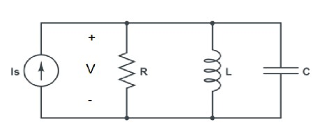
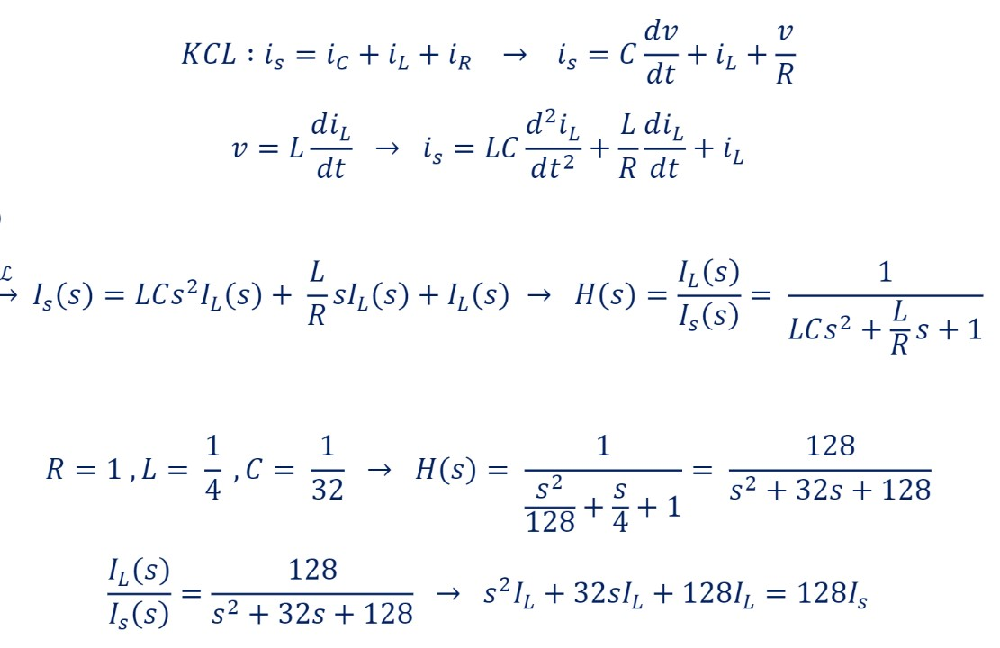
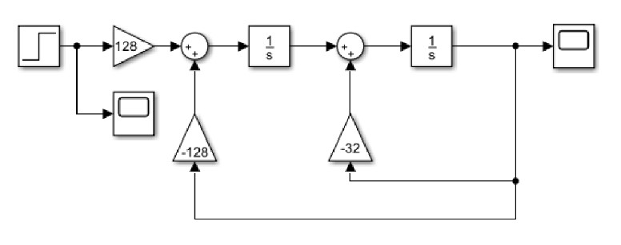
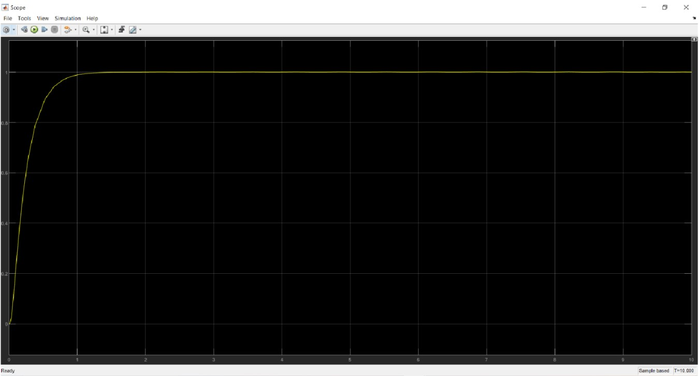
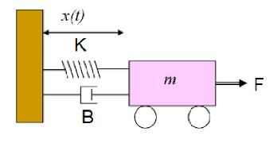
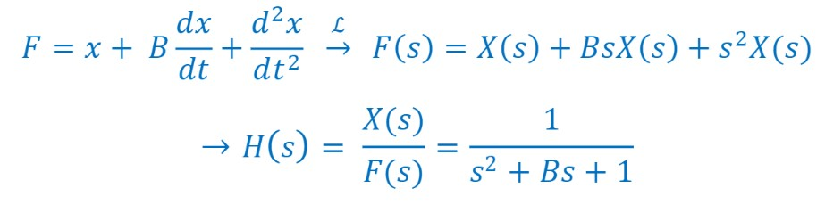
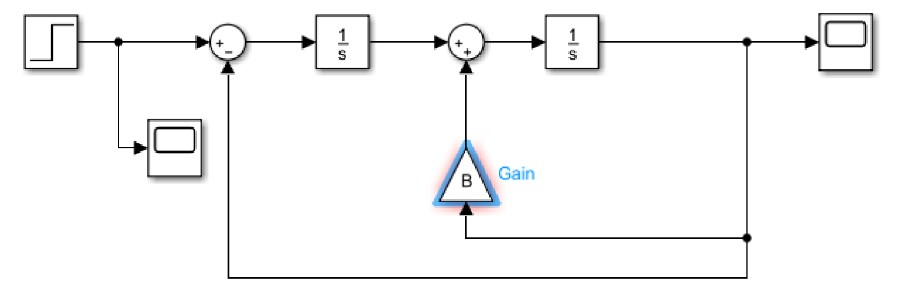

# Laplace Transform
Modeling [mechanical](https://github.com/fardinabbasi/Laplace_Transform/blob/main/Part2.slx) and [electrical](https://github.com/fardinabbasi/Laplace_Transform/blob/main/Part1.slx) systems using Laplace transform in MATLAB.

## Part 1: Electrical System
Simulation of the following RLC Circuit Using the Laplace Transform.

The relationship between the inductor's current $(I_L)$ and the input current $(I_s)$ is obtained using the Laplace transform through the following procedure.

Finally, here is the final equation:
$$I_L = \frac{{128I_s - 128I_L}}{{s^2}} - \frac{{32I_L}}{s}$$

The **block diagram** below illustrates the system response when a step input is applied as the input current.

Furthermore, the simulation result obtained from **Simulink** is provided below.

## Part 2: Mechanical System
Simulation of the following Spring-Mass-Damper System Using the Laplace Transform.

The relationship between the input force $(F)$ and the output distance from the wall $(X)$ can be derived using the **Laplace transform** by following the procedure outlined below.

The minimum value for parameter $B$, which ensures that the transfer function's poles are real, is 2.

$\Delta = B^2 - 4 \rightarrow \beta = B_{\text{min}} = 2$

The block diagram below illustrates the system response when a step input is applied as the force.

Furthermore, the simulation result with different values for $B$ obtained from **Simulink** is provided below.

| $B = \beta =2$ | $B = 0 (Complex Poles)$ |
| --- | --- |
|  |  |
| $B = 1 < \beta (Complex Poles)$ | $B = 4 > \beta$  |
|  |  |

1. $B = \beta =2$: After applying the force, the system **stabilizes** over time.
2. $B = 0$: The poles being **purely imaginary** result in a **non-oscillatory** response.
3. $B = 1 < \beta$: The poles being **complex** result in a **damped oscillation**.
4. $B = 4 > \beta$: With **real** poles, the system oscillates over time but at a slower rate compared to the case when $B = \beta =2$.

## Course Description
- **Course**: Signals and Systems [ECE 538]
- **Semester**: Spring 2022
- **Institution:** [School of Electrical & Computer Engineering](https://ece.ut.ac.ir/en/), [College of Engineering](https://eng.ut.ac.ir/en), [University of Tehran](https://ut.ac.ir/en)
- **Instructors:** Dr. Akhavan
- **Contributors:** [Fardin Abbasi](https://github.com/fardinabbasi), Iman Rasouli-Parto, Parsa Sattari
